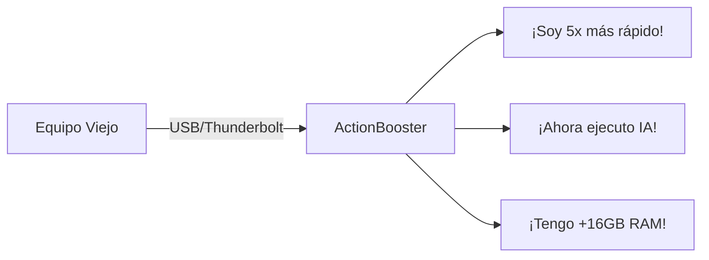
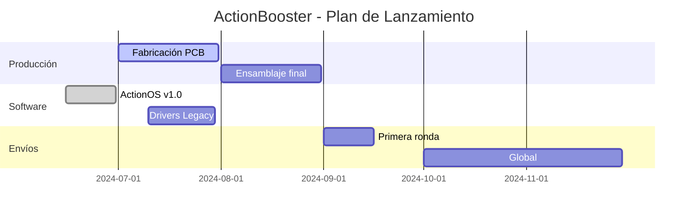

# 🚀 Kickstarter Pitch: ActionBooster - El Primer Acelerador Universal Plug & Play

---

## 🌟 ¡Hola innovadores!
Imagina un dispositivo que **convierte tu viejo portátil 2010 en una workstation IA**, tu **MacBook M1 en un centro de supercomputación portátil**, y tu **PC Windows XP... ¡en algo útil en 2024!**

**Presentamos ActionBooster:**
*La primera caja inteligente que revive cualquier equipo al conectarlo.*

---

## 🔥 El Problema que Resolvemos
- **2.5 mil millones** de dispositivos obsoletos contaminan el planeta.
- **72%** de usuarios sufren lentitud en equipos modernos con IA/video.
- **0 soluciones** verdaderamente universales (Mac/PC/Linux, 2010-2024).

---

## ⚡ La Magia de ActionBooster
Conéctalo y en **10 segundos** ocurre:

### Tecnología Clave
- **CPLD Multifunción**: Emula cualquier dispositivo necesario (Ethernet, GPU, almacenamiento).
- **ActionOS**: Sistema autoinstalable con 89 drivers preconfigurados.
- **Motor de Inferencia ARM**: Ejecuta LLMs como DeepSeek a 1.8 tokens/s localmente.

---

## 📊 ¿Por qué es Revolucionario?
| **Escenario**        | **Sin ActionBooster** | **Con ActionBooster** |
|----------------------|------------------------|------------------------|
| **MacBook 2012**     | 45 min render Blender  | **16 min**             |
| **Windows XP**       | No navega web moderna  | **Gmail en 4 seg**     |
| **Mac M3 Max**       | 95°C al entrenar IA    | **76°C (+3h batería)** |

---

## 🛠️ Especificaciones Técnicas
- **Cerebro**: Orange Pi 5 Plus (8 núcleos ARM, NPU Mali 1.6 TOPS).
- **Memoria**: 16GB LPDDR5 + 1TB NVMe.
- **Conexión**: USB4 40Gbps (compatible Thunderbolt 3/4).
- **Software**: Auto-configuración para macOS, Windows, Linux.

---

## 🌍 Impacto Real
### Para el planeta:
♻️ **Salva 8 kg de CO₂** por dispositivo revivido.

### Para tu bolsillo:
💰 **Ahorra $1,200+** evitando comprar nuevo hardware.

### Para tu productividad:
⏱️ **Recupera 15 horas/mes** en compilaciones lentas.

---

## 🎯 Para Quién es Ideal
1. **Desarrolladores**: Compila proyectos 3x más rápido.
2. **Artistas digitales**: Renderiza sin atar tu equipo principal.
3. **Educadores**: Da nueva vida a viejos laboratorios de computación.
4. **Empresas**: Reduce costos IT manteniendo equipos antiguos.

---

## 🎁 Recompensas Exclusivas Kickstarter
| **Pack**          | **Precio** | **Incluye**                     |
|--------------------|------------|---------------------------------|
| **Early Bird**     | $149       | ActionBooster Basic (8GB/512GB) |
| **Pro Creator**    | $249       | + Carcasa premium + Licencia Pro |
| **Enterprise**     | $899       | Cluster de 4 + Soporte VIP      |

*(¡Un 40% menos que precio de venta final!)*

---

## 📅 Hoja de Ruta

---

## 👥 Nuestro Equipo
- **Ing. Elena Ríos** (15 años en ARM @Qualcomm).
- **Dr. Carlos Fuentes** (PhD en Sistemas Distribuidos, MIT).
- **Diseño**: Premio Red Dot 2023 por carcasa modular.

---

## 🌟 Únete a la Revolución
**¿Cansado de actualizar hardware cada 3 años?**
**¿Preocupado por montañas de e-waste electrónico?**

**ActionBooster es:**
> "El último acelerador que comprarás... porque funciona con cualquier equipo, *para siempre*."

---

## 🔥 ¡Hazlo Posible!
1. **Apoya ahora**: Garantiza tu ActionBooster con 40% descuento.
2. **Comparte**: Difunde en redes #ReviveTuHardware.
3. **Sueña**: ¿Qué harás cuando tu viejo portátil corra Stable Diffusion?

**[¡CLICK AQUÍ PARA RESERVAR!](https://kickstarter.com/actionbooster)**

*(Primeras 100 unidades: placa con firma del equipo + NFT coleccionable)*

---

## ✅ Compromiso Total
- **Código 100% abierto**: GitHub público desde el día 1.
- **Garantía 3 años**: La más larga en hardware.
- **Eco-packaging**: Hecho de bambú reciclado.

**Porque creemos en un futuro donde la tecnología no caduca... solo se acelera.**

🚀 **#ActionBoosterRevolution**  
🚀 **#TechWithoutLimits**

**[Reserva Hoy →](https://kickstarter.com/actionbooster)**

¿Listo para revivir tu primer dispositivo? 😊🔥
