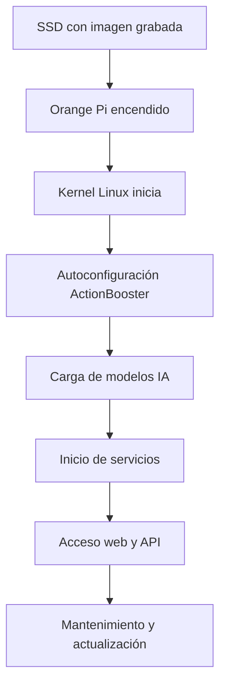

# Proceso de Carga y Arranque en Orange Pi para ActionBooster

## 1. Preparación del Sistema
- **Descarga la imagen del sistema operativo** (ej: Armbian, Ubuntu, ActionOS optimizado).
- **Graba la imagen en el SSD/NVMe** usando `dd` o herramientas gráficas (Balena Etcher).

```bash
sudo dd if=actionos.img of=/dev/sdX bs=4M status=progress
```

## 2. Primer Arranque
- Conecta el SSD/NVMe a la Orange Pi y enciende el dispositivo.
- El sistema realiza autodetección de hardware y configura periféricos (USB, red, HDMI).
- Se inicia el kernel Linux y los servicios básicos.

## 3. Autoconfiguración ActionBooster
- El script `autoconfig.py` se ejecuta al inicio (puede añadirse a `rc.local` o como servicio systemd).
- Detecta el sistema operativo, arquitectura y recursos disponibles.
- Despliega el modo óptimo (legacy, DMA, cluster) según el host conectado.

## 4. Carga de Modelos de IA
- Los modelos GGUF (DeepSeek, Qwen, Kimi) se almacenan en `/ssd/models/` o `/home/orangepi/models/`.
- El agente multi-modelo (`agent_app.py`) carga los modelos en RAM al iniciar el servicio.
- Se recomienda usar zRAM y swap en SSD para ampliar la memoria virtual si es necesario.

### Descarga de Modelos de IA
Para descargar los modelos DeepSeek, Qwen y Kimi en formato GGUF, ejecuta:

```bash
# Crear carpeta de modelos
mkdir -p /ssd/models
cd /ssd/models

# DeepSeek-Coder 1.3B
wget https://huggingface.co/TheBloke/deepseek-coder-1.3B-GGUF/resolve/main/deepseek-coder-1.3b.Q4_K_M.gguf

# Qwen 1.8B
wget https://huggingface.co/TheBloke/Qwen1.5-1.8B-Chat-GGUF/resolve/main/qwen1.5-1.8b-chat-q4_k_m.gguf

# Kimi 1.8B
wget https://huggingface.co/TheBloke/Kimi-1.8B-GGUF/resolve/main/kimi-1.8b.Q4_K_M.gguf
```

Coloca los archivos descargados en la ruta configurada en tu agente (`agent_app.py`).

## 5. Inicio de Servicios
- Los servicios systemd (`ai-agent.service`, `parallel-api.service`) se activan automáticamente.
- El portal web y la API Flask quedan disponibles en la red local.

## 6. Acceso y Operación
- Accede al portal web desde otro dispositivo vía `http://actionbooster.local` o IP local.
- Realiza consultas IA, distribuye tareas y monitoriza el sistema.

## 7. Mantenimiento y Actualización
- Usa los scripts de backup, restauración y limpieza de caché para mantener el sistema eficiente.
- Actualiza modelos y scripts según sea necesario.

---

## Diagrama de Flujo


---

## Recomendaciones
- Usa SSD/NVMe de calidad para mayor velocidad y durabilidad.
- Configura zRAM y swap si ejecutas modelos grandes.
- Mantén los servicios actualizados y realiza backups periódicos.

---

## Ejemplo de Automatización (systemd)
Archivo: `/etc/systemd/system/ai-agent.service`
```ini
[Unit]
Description=ActionBooster AI Agent
After=network.target

[Service]
Type=simple
User=orangepi
WorkingDirectory=/home/orangepi
ExecStart=/home/orangepi/ai_env/bin/python /home/orangepi/agent_app.py
Restart=always
Environment="PYTHONUNBUFFERED=1"

[Install]
WantedBy=multi-user.target
```

---

## Recursos
- [Documentación oficial Orange Pi](http://www.orangepi.org/downloadresources/)
- [Guía ActionBooster](./HARDWARE_GUIDE.md)
- [Documentación técnica](./TECHNICAL_DOCUMENTATION.md)
