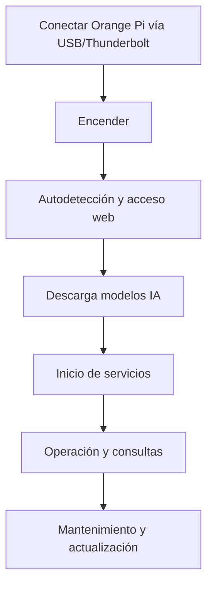
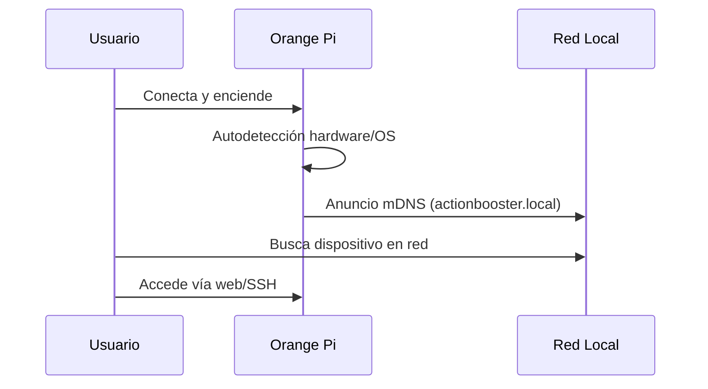
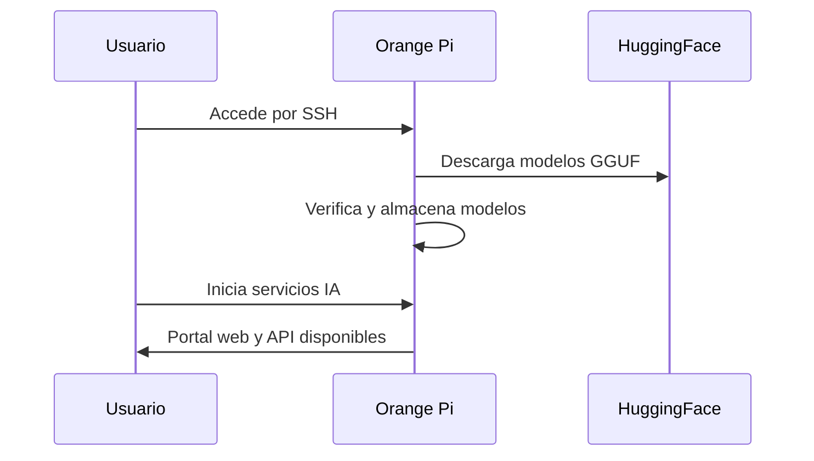
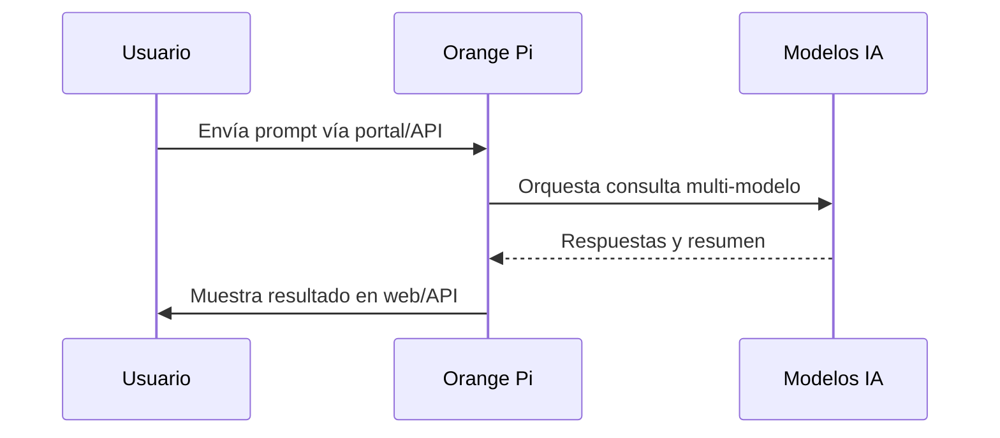
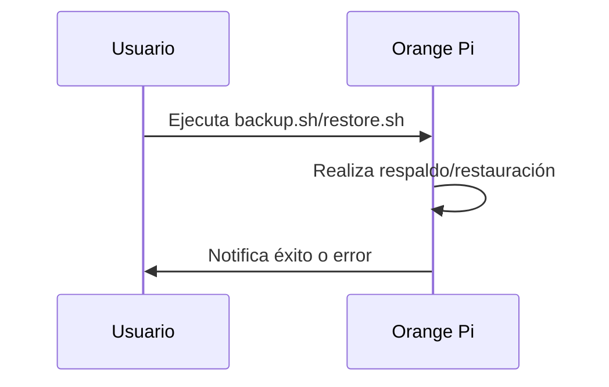
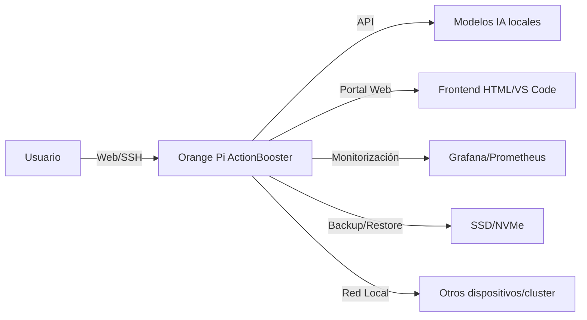
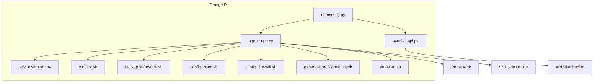
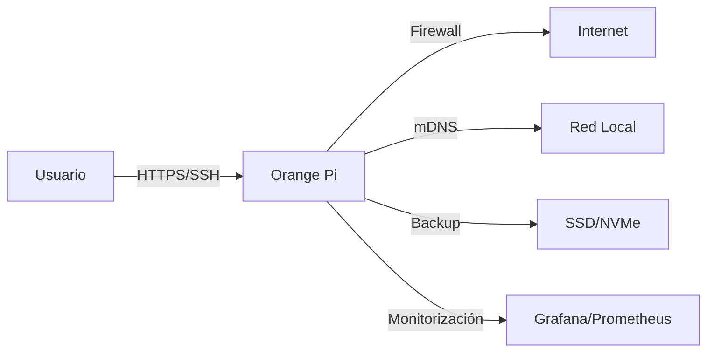

# Tutorial Paso a Paso: Arranque y Operación de ActionBooster en Orange Pi

## 1. Conectar el Dispositivo
- Conecta la Orange Pi al host (PC, Mac, servidor) usando cable USB, USB-C o Thunderbolt.
- Si usas SSD/NVMe externo, asegúrate de que esté conectado antes de encender.

## 2. Encender y Autodetección
- Enciende la Orange Pi.
- El sistema operativo inicia y detecta automáticamente el hardware y periféricos.
- El dispositivo aparece en la red local como `actionbooster.local` (mDNS).

## 3. Acceso Inicial
- Desde el host, accede vía navegador a `http://actionbooster.local` o la IP asignada.
- Verifica que la página de bienvenida o el portal web esté disponible.

## 4. Preparar el Sistema
- Si es la primera vez, graba la imagen del sistema operativo en el SSD/NVMe:

```bash
sudo dd if=actionos.img of=/dev/sdX bs=4M status=progress
```

- Inserta el SSD/NVMe en la Orange Pi y repite el paso de encendido.

## 5. Autoconfiguración ActionBooster
- El script `autoconfig.py` se ejecuta automáticamente al inicio.
- Detecta el sistema operativo, arquitectura y recursos del host.
- Selecciona el modo óptimo (legacy, DMA, cluster) según el entorno.

## 6. Descarga y Carga de Modelos de IA
- Accede por SSH o terminal local:

```bash
ssh orangepi@actionbooster.local
```

- Descarga los modelos DeepSeek, Qwen y Kimi:

```bash
mkdir -p /ssd/models
cd /ssd/models
wget https://huggingface.co/TheBloke/deepseek-coder-1.3B-GGUF/resolve/main/deepseek-coder-1.3b.Q4_K_M.gguf
wget https://huggingface.co/TheBloke/Qwen1.5-1.8B-Chat-GGUF/resolve/main/qwen1.5-1.8b-chat-q4_k_m.gguf
wget https://huggingface.co/TheBloke/Kimi-1.8B-GGUF/resolve/main/kimi-1.8b.Q4_K_M.gguf
```

- Verifica que los archivos estén en la ruta configurada en `agent_app.py`.

## 7. Configuración de Memoria Virtual (Opcional)
- Para modelos grandes, activa zRAM y swap:

```bash
sudo apt install zram-config
sudo fallocate -l 16G /swapfile
sudo chmod 600 /swapfile
sudo mkswap /swapfile
sudo swapon /swapfile
```

## 8. Inicio de Servicios
- Los servicios systemd (`ai-agent.service`, `parallel-api.service`) se activan automáticamente.
- Para iniciar manualmente:

```bash
source ~/ai_env/bin/activate
python agent_app.py &
python parallel_api.py &
```

## 9. Acceso al Portal Web y API
- Desde cualquier dispositivo en la red, accede a:
    - Portal web: `http://actionbooster.local`
    - VS Code online: `http://actionbooster.local:8080`
    - API IA: `http://actionbooster.local:5000/query`

## 10. Operación y Consultas
- Realiza consultas IA desde el portal web o vía API REST:

```bash
curl -X POST http://actionbooster.local:5000/query -H 'Content-Type: application/json' -d '{"prompt": "Optimiza este código Python..."}'
```

## 11. Mantenimiento y Actualización
- Ejecuta scripts de backup, restauración y limpieza de caché según necesidad:

```bash
bash backup.sh
bash restore.sh
bash clean_cache.sh
```

- Para actualizar modelos:

```bash
cd /ssd/models
wget -O nuevo_modelo.gguf https://huggingface.co/.../modelo.gguf
sudo systemctl restart ai-agent
```

## 12. Solución de Problemas
- Si no aparece en la red, verifica cables y alimentación.
- Revisa logs en `/var/log/` y archivos `.log` en la carpeta de trabajo.
- Usa `monitor.sh` para ver uso de CPU, RAM y temperatura.

---

## Ejemplo Avanzado: Entrenamiento Distribuido con ActionBooster

```python
from actionboost import DistributedTrainer
trainer = DistributedTrainer(model, devices=["m3", "actionbooster"])
trainer.run()
```

---

## Ejemplo Avanzado: Simulación CFD con MPI

```bash
mpirun -hosts m3.local,actionbooster.local -np 12 ./simulation
```

---

## Ejemplo Avanzado: Optimización de Código Python

```bash
curl -X POST http://actionbooster.local:5000/query -H 'Content-Type: application/json' -d '{"prompt": "Optimiza este código Python: def fib(n): ..."}'
```

---

## Capturas de Pantalla (Referencia)

1. **Portal Web ActionBooster**
   

2. **VS Code Online**
   

3. **Panel de Control y Monitorización**
   

4. **Terminal SSH y Descarga de Modelos**
   

---

## Recursos Visuales
- Para capturas reales, consulta la carpeta `/screenshots` o realiza capturas en tu entorno y añádelas aquí.

---

## Diagrama Resumido


---

## Flujos Interactivos Visuales

### 1. Arranque y Autodetección


### 2. Carga y Ejecución de Modelos IA


### 3. Consulta y Respuesta IA


### 4. Mantenimiento y Backup


---

## Diagramas de Arquitectura y Flujo

### Diagrama General de Arquitectura


### Diagrama de Servicios y Scripts


### Diagrama de Red y Seguridad


---

## Recursos
- [Documentación oficial Orange Pi](http://www.orangepi.org/downloadresources/)
- [Guía ActionBooster](./HARDWARE_GUIDE.md)
- [Documentación técnica](./TECHNICAL_DOCUMENTATION.md)
- [Proceso de carga y arranque](./ORANGE_PI_BOOT_PROCESS.md)

---

## Preguntas Frecuentes (FAQ)

**¿Qué hago si no veo el dispositivo en la red?**
- Verifica cables, alimentación y que el router soporte mDNS.
- Usa la IP directa si `actionbooster.local` no responde.
- Prueba con `arp -a` o apps de escaneo de red para encontrar la IP.

**¿Es seguro exponer el portal web a Internet?**
- No se recomienda sin firewall y TLS. Usa VPN o túneles seguros para acceso remoto.

**¿Cómo optimizo el rendimiento?**
- Prioriza zRAM sobre swap en NVMe para menor latencia.
- Mantén el sistema actualizado y monitoriza recursos con Grafana.

**¿Puedo restaurar el sistema si falla?**
- Sí, usa los scripts de backup y restauración incluidos.

---

## Consejos de Seguridad y Buenas Prácticas

- Cambia la contraseña por defecto del usuario `orangepi` tras el primer acceso.
- Habilita el firewall (`config_firewall.sh`) y revisa puertos abiertos.
- Realiza backups antes de actualizar modelos o el sistema.
- No expongas puertos críticos (5000, 8080) sin protección.
- Usa TLS (certificados autofirmados o de Let's Encrypt) para el portal y la API.

---

## Troubleshooting Rápido

- **No aparece en la red:**
  - Revisa cables, alimentación y router.
  - Prueba con otro puerto USB o fuente de poder.
- **Portal web no carga:**
  - Verifica logs en `agent_app.log` y que el puerto 8080 esté libre.
  - Asegúrate de que los servicios estén activos (`systemctl status ai-agent`).
- **Modelos IA no cargan:**
  - Verifica rutas y permisos de los archivos GGUF.
  - Revisa espacio libre en SSD/NVMe.
- **Bajo rendimiento:**
  - Consulta el dashboard de Grafana y ajusta swap/zRAM.
- **Problemas de red/mDNS:**
  - Instala/activa `avahi-daemon` para soporte mDNS en Linux.

---

## Recomendaciones Finales

- Mantén el sistema y scripts actualizados desde el repositorio oficial.
- Documenta cambios y personalizaciones para futuras restauraciones.
- Participa en la comunidad para soporte y mejoras.

---
